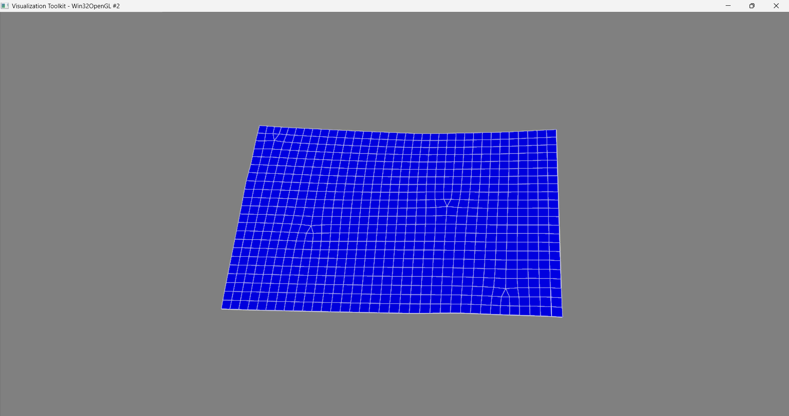

# VTKNastranViewer

  

## 🚀 Overview
A high-fidelity visualization tool designed to parse **Nastran Bulk Data Files (.bdf/.dat)** and render the finite element mesh using the **Visualization Toolkit (VTK)** pipeline.

This project features a **Dual-Engine Architecture**, allowing users to switch between a lightweight **Custom Parser** (for speed on raw geometry) and the industry-standard **pyNastran** library (for full card compatibility).

**Context:** Developed as an **Independent Research Project** to benchmark custom I/O performance against established libraries and master the BDF file format structure.

## 📸 Visualization Output


## 🔧 Key Technical Features
* **Hybrid Parsing Strategy:**
    * **Engine A (pyNastran):** Robust support for complex cards, coordinate systems, and material properties.
    * **Engine B (Custom C++ Style):** A localized, regex-free reader optimized purely for GRID/Connectivity extraction, offering lower memory overhead for simple checks.
* **VTK Visualization Pipeline:** * Implemented a unified `GeometryBuilder` class that accepts data from *either* parser and generates the `vtkUnstructuredGrid`.
* **Performance:** The custom parser demonstrates $O(n)$ complexity for node lookup using direct array indexing, bypassing the overhead of full object-oriented card instantiation.

## 🛠️ Environment & Installation
This project was developed and verified using **Miniconda 25.11.1**.

**Verified Stack:**
* **Python:** 3.12.12
* **VTK:** 9.4.1
* **pyNastran:** 1.4.1
* **Pip:** 25.3

### Quick Setup (Recommended)
```bash
# 1. Create a fresh conda environment
conda create -n cae_viz python=3.12.12
conda activate cae_viz

# 2. Install dependencies
pip install vtk==9.4.1 pyNastran==1.4.1 numpy

# 3. Clone and Run
git clone [https://github.com/KabilanKumar36/py-nastran-visualizer.git](https://github.com/KabilanKumar36/py-nastran-visualizer.git)
cd py-nastran-visualizer
python main.py --file samples/plate_hole.bdf --parser pynastran
